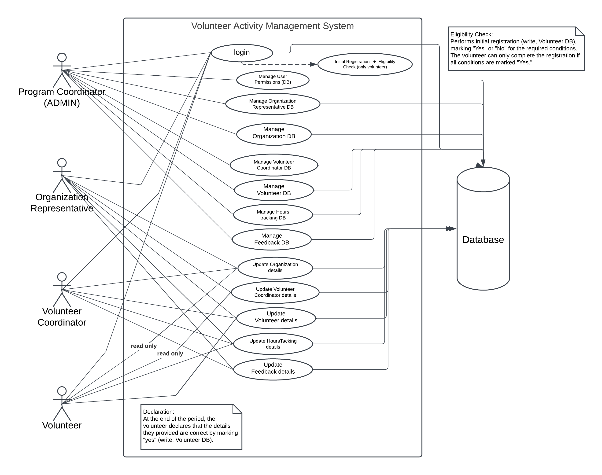

# 🎓 Beit-Berl-Academic-College-s-Social-Engagement-Unit-

## 👨‍💻 Our Developers Team
- 🚀 Dana Salh
- 🚀 Tehila Raviv
- 🚀 Noa Uzan 
- 🚀 Saar Niran

The Social Engagement Unit allows students to receive academic recognition
 in exchange for at least 60 hours of volunteer work with various social
 organizations
 
### 🎯 **Project Goal** 
he goal of this project is to develop a **digital system** that will streamline and enhance the management of student volunteer activities.  

### 🚀 **The System Will:**  
✔ **Replace outdated paper-based tracking** with an efficient digital solution.  
✔ **Simplify communication** between students, volunteer coordinators, and administrators.  
✔ **Ensure accurate tracking** of volunteer hours and activities.  
✔ **Provide real-time insights and reports** for better decision-making.

## 📊 Use Case Diagram

 
